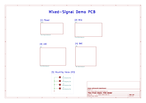

# Mixed-Signal-Hardware-Design

## 📌 Project Summary
This repository contains a mixed-signal hardware design project covering system-level design, schematic capture, analog simulation, and PCB layout.  
The project demonstrates best practices in analog/digital partitioning, component selection, simulation-driven design, and manufacturable PCB layout.

## 🧰 Tools Used
- **KiCad** – Schematic capture and PCB design  
- **LTSpice** – Analog circuit simulation  
- **STM32CubeIDE** – MCU pinout planning  
- **draw.io** – System block diagram

## 🧱 System Block Diagram

Refined version
  

## 📐 Schematic Design

